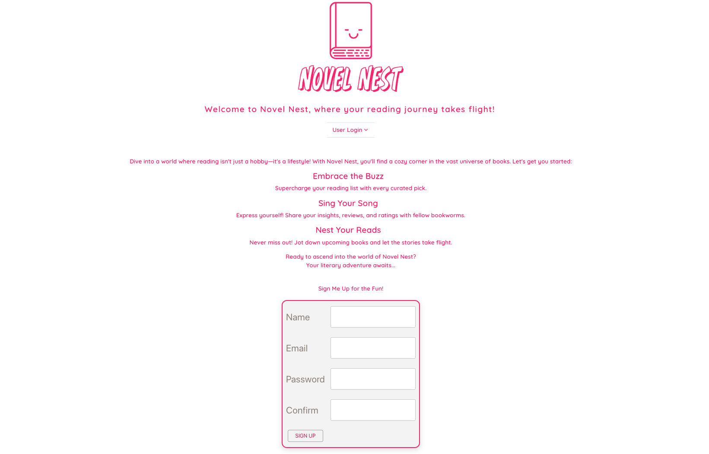
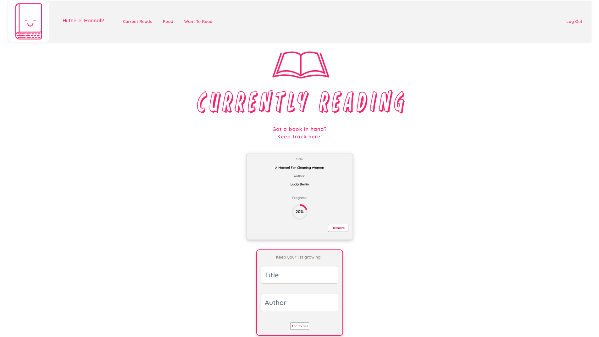
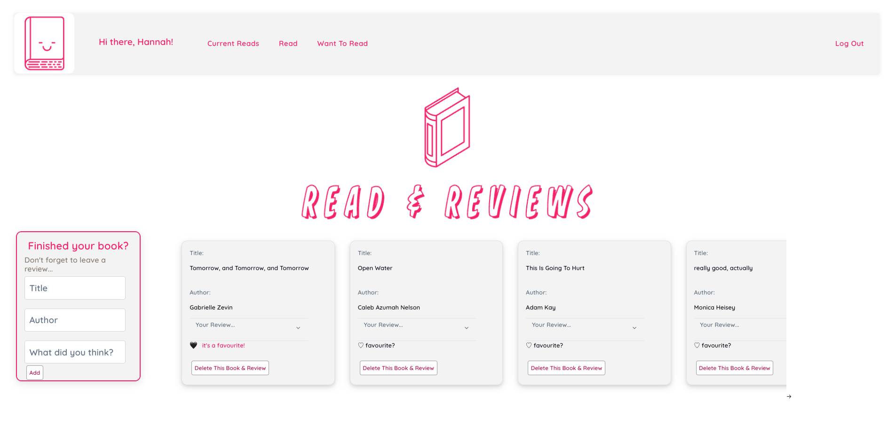
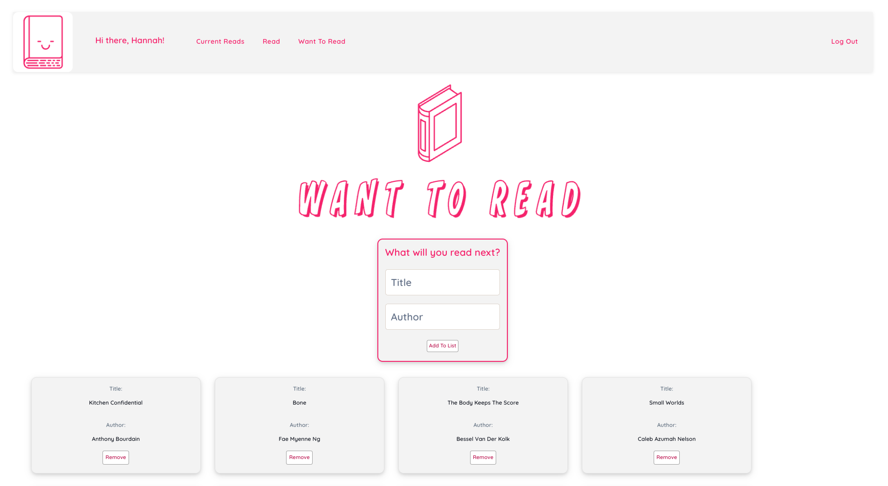
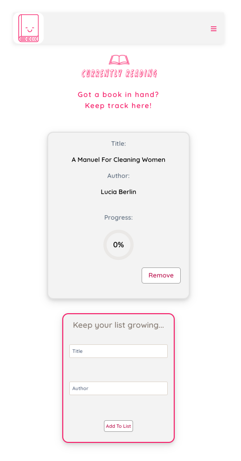

WHAT'S NOVEL NEST? <br><br>
Welcome to Novel Nest, the culmination of Project 4 from my software engineering bootcamp journey. Designed with the modern reader in mind, this MERN stack application serves as a dedicated space for book worms to manage their reading universe. With features that allow users to track their ongoing reads, update reading progress in real-time, curate a 'Want-To-Read' list, and archive completed books with personal reviews or favorites, Novel Nest strives to turn pages rather than screen time. Dive in and let's reclaim the joy of reading, making it more engaging, organized, and inspiring. Let's read more and scroll less! 📚✨


<br><br>
SCREENSHOTS:<br><br>

 
<br>

<br>

<br>

<br>


<br><br>
GETTING STARTED & PLANNING:<br><br>
Trello, draw.io and Lucidchart were used within planning for this project. The planning included Wireframes and an Entity-Relationship-Diagram (ERD) which were included on a Trello board. This board was also used to organise the user stories and tasks required to implement the project. 
<br>

Here is a link to the Trello board: https://trello.com/b/EkoL7t7v/project-4-novel-nest 

<br><br>
DEPLOYED LINK:<br>
https://novel-nest-0146cd2b263d.herokuapp.com/ 


<br><br>
TECHNOLOGIES USED: <br>
• HTML <br>
• CSS<br>
• Chakra UI<br>
• MongoDB/Mongoose<br>
• Express<br>
• React<br>
• Node <br>
• Heroku<br>


<br><br>
BRIEF: <br>
☐ Build a working full-stack, single-page application hosted on Heroku. <br>

☐ Incorporate the technologies of the MERN-stack:<br>
• MongoDB/Mongoose<br>
• Express<br>
• React<br>
• Node <br>

☐ Have a well-styled interactive front-end.<br>

☐ Communicates with the Express backend via AJAX.<br>

☐ Implement token-based authentication. Including the ability of a user to sign-up, log in & log out.<br>

☐ Implement authorization by restricting CUD data functionality to authenticated users. Also, navigation should respond to the login status of the user.<br>

☐ Have a well-scoped feature-set.<br>


<br><br>
BUILD CODE & PROCESS<br><br>

☐ The "main" Mongoose model is the bookSchema - this is the backbone of the app's functionality. This model helps structure and store essential data about a user's reading list:
<br>

```
const mongoose = require('mongoose');
const Schema = mongoose.Schema;
const { ObjectId } = require('mongodb');

const bookSchema = new Schema({
    title:{ type: String, required: true},
    author:{ type: String, required: true},
    status: { type: String, enum: ['currently reading', 'want to read' ,'read'], required: true }, 
    user: { type: ObjectId, required: true },
    review: {type: String},
    isFavorite: { type: Boolean, default: false },
    progress: { type: Number, default: 0, min: 0, max: 100 }
 
});

module.exports = mongoose.model('Book', bookSchema);
```
<br>
<br>

☐ The ReadBookCard React component holds a major place in the architecture of Novel Nest, and here's why it's my favourite:<br>

• Dynamic Interaction: With the incorporation of Chakra UI's Accordion elements, this component introduces a beautiful layer of interactivity. Users can expand or collapse their reviews, making the interface less cluttered and more intuitive.<br>

• Editable Reviews: The seamless integration of the Editable feature ensures users can modify their thoughts on a book even after jotting them down initially. This dynamic editing process, paired with the expansive EditableTextarea, offers flexibility in expression.<br>

• Visual Feedback: The use of heart icons (🖤 & ♡) for the favorite functionality provides instant visual feedback, creating an engaging and fun user experience. It's a small touch, but these details make the experience more delightful for users.<br>

• Cohesiveness: The component efficiently manages several functionalities, from displaying book details, editing reviews, toggling favorite status, to deleting a book. Yet, it maintains a clear and clean structure. This harmonious blend of utility and design speaks to the power of thoughtful React component development.<br>

```
import React, { useState } from "react";
import { Box, Editable, EditableTextarea, EditablePreview } from '@chakra-ui/react';
import { Accordion, AccordionItem, AccordionButton, AccordionPanel, AccordionIcon } from '@chakra-ui/accordion';

export default function ReadBookCard({ readBook, onDelete, onEdit, onToggleFavorite, handleSaveEdit, }) {
    const [editedReview, setEditedReview] = useState(readBook.review)
    return (
        <div className="read-book-card">
            <p className="book-title">Title:</p> <p>{readBook.title}</p>
            <br />
            <p className="book-author">Author:</p> <p> {readBook.author}</p>

            <Accordion allowMultiple>
                <Box w="100%" maxWidth="315px">
                    <AccordionItem >
                        <h2>
                            <AccordionButton w="100%">
                                <Box as="span" flex='4' textAlign='left'>
                                    <p className="review-title">Your Review...</p>
                                </Box>
                                <AccordionIcon color={"gray"} />
                            </AccordionButton>
                        </h2>

                        <AccordionPanel w="100%" >
                            <Editable value={editedReview} onChange={(value) => setEditedReview(value)} w="100%" >
                                <EditablePreview w="100%" h="100%" />
                                <EditableTextarea minH="500px" w="100%" resize="vertical" />
                            </Editable>
                            <br />
                            <button onClick={() => handleSaveEdit(readBook._id, editedReview)} className="readbook-submit-btn">&nbsp;&nbsp;&nbsp;Save&nbsp;&nbsp;&nbsp;</button>
                        </AccordionPanel>
                    </AccordionItem>
                </Box>
            </Accordion>

            <div className="favorite-icon" onClick={onToggleFavorite}>
                <button onClick={onToggleFavorite}>
                    {readBook.isFavorite ? <span className="favorite-text" >🖤 &nbsp; it's a favourite! </span> : <span>♡ favourite?</span>}
                </button>
            </div>

            <div>
                <br />
                <button onClick={() => onDelete(readBook._id)} className="readbook-submit-btn">Delete This Book & Review</button>
            </div>
        </div>
    )
}
```

<br><br>
CHALLENGES: <br><br>
During the project, I hit some blockers at times when coding between the backend and frontend within the unified codebase. One thing that gave me a real challenge was adding a daily streak tracker. It's not fully ready yet, but I'll keep working on that! <br> <br>

When it came to styling, that was another hurdle. I leaned on CSS and incorporated some Chakra UI, but achieving the perfect design feel wasn't easy. Design and styling are definitely areas I want to dive deeper into. More practice will surely help me get better at it!

<br><br>
WINS: <br><br>
During the development of this project, I'm particularly proud of constructing a comprehensive MERN stack application from the ground up. It's fully equipped with robust CRUD operations for real-time data management and interaction. Plus, I got the signup and login mechanisms up and running, ensuring personalized user sessions. The current version of the app is simple, but it offers a seamless and user-friendly interface that I'm genuinely pleased with. As I move forward, I'm eager to expand upon its existing foundations and enhance it further after the course concludes.

<br><br>
BUGS:<br><br>
☐ The progress trackers on the Currently Reading Page are not saving to the database yet and reset to 0% when the page is refreshed - this is something I am still working on at the time of presenting. <br>

☐ The Accordion drop down for Reviews is only displaying the first line of the review unless it is clicked (then the whole review will appear in an editable field). I have been working and trying different methods to have the review be fully visible once the accordion panel drops down, however, this is proving to be a trickier styling issue than expected and I'm still working on this!<br>

<br><br>
KEY LEARNINGS & TAKEAWAYS: <br><br>

☐ Depth of Full Stack Development: The intricacies of integrating both backend and frontend in a MERN app gave me a deeper appreciation of the challenges and rewards of full-stack development. It's more than just code—it's about orchestrating multiple systems to work in harmony.<br>

☐ Importance of User Experience: While the backend logic is crucial, ensuring a smooth user interface and experience is just as vital.<br>

☐ Authentication Matters: Implementing signup and login functionalities emphasized the importance of user data security and privacy. It's not just about access, but also about ensuring data integrity and protection.<br>

☐ Continuous Learning and Persistence is Key: The ever-evolving world of web development requires continuous learning. From trying to implement a daily streak tracker to diving deep into styling with CSS and Chakra UI, every challenge was a lesson in persistence and adaptability.<br>

☐ The Value of Iteration: Building a project isn't a one-and-done task. It's an ongoing process of refining, testing, and improving. This project reinforced the notion that every iteration, no matter how minor, can significantly impact the overall quality and functionality of an application.<br>

<br><br>
FUTURE ENHANCEMENTS & CONTINUOUS IMPROVEMENT:<br><br>

☐  To have a function so that when the progress tracker on Current Book Cards reaches 100% (ie a book is finished), the book is moved out of the 'Currently Reading'/ Current Book Card page and displayed on a Read Book Card. Currently this has to be done manually by the user. 

☐ To have a 'Daily Streak' feature that updates when the user logs in - to encourage the user's engagement with the app.  <br>

☐ Develop a feature to be able to connect with friends and other users through the app and for users to be able to have the option to allow other users to view their lists. <br>

☐ To incorporate an API that could offer book recommendations based on what the user has been reading and favorited in their 'Read Books' page. <br>


